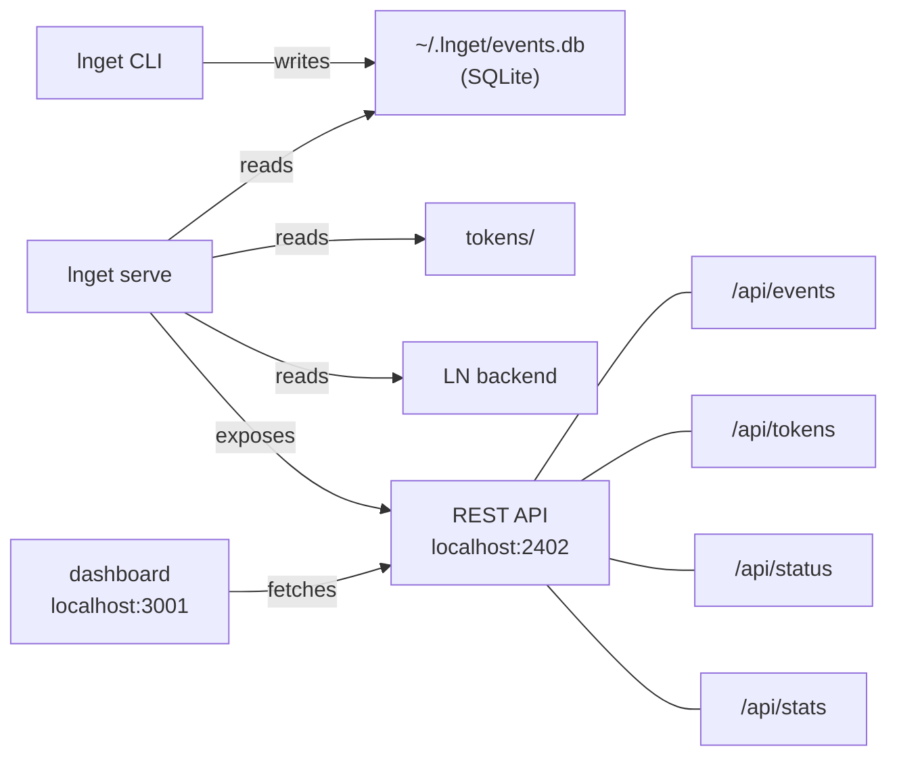

# lnget Architecture

This document explains the design decisions behind lnget and how the components fit together.

## Design Philosophy

### Functional Core, Imperative Shell

lnget follows the "functional core, imperative shell" pattern:

```
┌─────────────────────────────────────────────────────────────┐
│                    Imperative Shell                         │
│  ┌─────────────────────────────────────────────────────┐   │
│  │  cmd/lnget/main.go    CLI entry point               │   │
│  │  cli/*.go             Cobra commands, I/O           │   │
│  └─────────────────────────────────────────────────────┘   │
│                            │                                │
│                            ▼                                │
│  ┌─────────────────────────────────────────────────────┐   │
│  │                   Functional Core                    │   │
│  │  ┌───────────┐  ┌───────────┐  ┌───────────┐       │   │
│  │  │   l402/   │  │  client/  │  │  config/  │       │   │
│  │  │           │  │           │  │           │       │   │
│  │  │ • Token   │  │ • HTTP    │  │ • Config  │       │   │
│  │  │ • Store   │  │ • L402    │  │ • Valid   │       │   │
│  │  │ • Header  │  │   Trans   │  │           │       │   │
│  │  │ • Handler │  │ • Resume  │  │           │       │   │
│  │  └───────────┘  └───────────┘  └───────────┘       │   │
│  └─────────────────────────────────────────────────────┘   │
│                            │                                │
│                            ▼                                │
│  ┌─────────────────────────────────────────────────────┐   │
│  │               External Dependencies                  │   │
│  │  ln/*.go        Lightning backends (lnd, LNC, etc)  │   │
│  │  Filesystem     Token storage, config files         │   │
│  │  Network        HTTP requests, gRPC to lnd          │   │
│  └─────────────────────────────────────────────────────┘   │
└─────────────────────────────────────────────────────────────┘
```

**Why this pattern?**

- **Testability**: Core logic (l402/, client/) has no I/O dependencies, making it easy to test with mocks
- **Clarity**: Side effects are contained in the shell, making the code easier to reason about
- **Flexibility**: Core can be reused in different contexts (CLI, library, server)

### Interface-Driven Design

Key components are defined as interfaces:

```go
// ln/interface.go
type Backend interface {
    Start(ctx context.Context) error
    Stop() error
    PayInvoice(ctx context.Context, invoice string, maxFeeSat int64,
               timeout time.Duration) (*PaymentResult, error)
    GetInfo(ctx context.Context) (*NodeInfo, error)
}

// l402/store.go
type Store interface {
    GetToken(domain string) (*Token, error)
    StorePending(domain string, token *Token) error
    StoreToken(domain string, token *Token) error
    RemoveToken(domain string) error
    ListTokens() (map[string]*Token, error)
}
```

**Why interfaces?**

- **Testing**: Easy to create mocks for unit tests
- **Extensibility**: Add new backends (LNC, neutrino) without changing core logic
- **Decoupling**: Core doesn't depend on specific implementations

## Component Architecture

### The L402 Transport Layer

The heart of lnget is `L402Transport`, an `http.RoundTripper`:

```
┌────────────────────────────────────────────────────────────┐
│                      http.Client                           │
│  ┌──────────────────────────────────────────────────────┐ │
│  │                   L402Transport                       │ │
│  │                                                       │ │
│  │  ┌─────────┐     ┌──────────┐     ┌─────────────┐   │ │
│  │  │  Check  │────▶│  Handle  │────▶│   Retry     │   │ │
│  │  │  Token  │     │   402    │     │   Request   │   │ │
│  │  └─────────┘     └──────────┘     └─────────────┘   │ │
│  │       │               │                  │          │ │
│  │       ▼               ▼                  ▼          │ │
│  │  ┌─────────┐     ┌──────────┐     ┌─────────────┐   │ │
│  │  │  Store  │     │  Handler │     │    Base     │   │ │
│  │  │  Cache  │     │  (pay)   │     │  Transport  │   │ │
│  │  └─────────┘     └──────────┘     └─────────────┘   │ │
│  └──────────────────────────────────────────────────────┘ │
└────────────────────────────────────────────────────────────┘
```

**Why RoundTripper?**

- Standard Go pattern for HTTP middleware
- Composable with other transports (logging, retry, etc.)
- Transparent to code using http.Client

**The flow:**

1. `RoundTrip` receives a request
2. Check store for cached token, add Authorization header if found
3. Make request via base transport
4. If 402, parse challenge and trigger Handler
5. Handler pays invoice, stores token
6. Retry request with Authorization header

### Per-Domain Token Storage

Tokens are stored by domain, not URL:

```
~/.lnget/tokens/
├── api.example.com/
│   └── token.json
├── data.service.io/
│   └── token.json
└── premium.api.net/
    └── token.json
```

**Why per-domain?**

- **L402 semantics**: Macaroons typically authorize access to a domain, not specific URLs
- **Simplicity**: One token per service, automatic reuse
- **Privacy**: Don't leak URL patterns in token storage

**Token file format:**

```json
{
  "macaroon": "base64...",
  "preimage": "hex...",
  "payment_hash": "hex...",
  "amount_msat": 100000,
  "fee_msat": 1000,
  "created_at": "2024-01-15T10:30:00Z"
}
```

### Pending Token Pattern

Before paying an invoice, lnget stores a "pending" token:

```
1. Receive 402 challenge
2. Store token as PENDING (macaroon only, no preimage)
3. Pay invoice
4. If payment succeeds: update token with preimage
5. If payment fails: pending token remains for recovery
```

**Why pending tokens?**

- **Crash recovery**: If lnget crashes mid-payment, we don't lose the macaroon
- **Payment tracking**: If payment is in-flight, we can track it
- **Idempotency**: Retry payment if it was interrupted

### Backend Abstraction

Lightning backends share a common interface:

```go
type Backend interface {
    Start(ctx context.Context) error
    Stop() error
    PayInvoice(...) (*PaymentResult, error)
    GetInfo(ctx context.Context) (*NodeInfo, error)
}
```

**Implementations:**

| Backend | Description | Use Case |
|---------|-------------|----------|
| `LNDBackend` | External lnd via gRPC | Production, existing node |
| `LNCBackend` | Lightning Node Connect | Remote access without macaroons |
| `NeutrinoBackend` | Embedded SPV wallet | Zero-config, self-contained |

**Why abstraction?**

- Same CLI works with any backend
- Users choose based on their setup
- Future backends (CLN, LDK) can be added

## Data Flow

### Successful Request with Payment

```
User                lnget              L402Transport       Store          Handler          LND
 │                   │                      │                │               │              │
 │ lnget url         │                      │                │               │              │
 │──────────────────▶│                      │                │               │              │
 │                   │ GET url              │                │               │              │
 │                   │─────────────────────▶│                │               │              │
 │                   │                      │ GetToken       │               │              │
 │                   │                      │───────────────▶│               │              │
 │                   │                      │ nil (no token) │               │              │
 │                   │                      │◀───────────────│               │              │
 │                   │                      │                │               │              │
 │                   │                      │───────────────────────────────────────────────▶│
 │                   │                      │         HTTP Request (no auth)                 │
 │                   │                      │◀──────────────────────────────────────────────│
 │                   │                      │ 402 + WWW-Authenticate: L402                  │
 │                   │                      │                │               │              │
 │                   │                      │ HandleChallenge│               │              │
 │                   │                      │───────────────────────────────▶│              │
 │                   │                      │                │ StorePending  │              │
 │                   │                      │                │◀──────────────│              │
 │                   │                      │                │               │ PayInvoice   │
 │                   │                      │                │               │─────────────▶│
 │                   │                      │                │               │ preimage     │
 │                   │                      │                │               │◀─────────────│
 │                   │                      │                │ StoreToken    │              │
 │                   │                      │                │◀──────────────│              │
 │                   │                      │ token          │               │              │
 │                   │                      │◀──────────────────────────────│              │
 │                   │                      │                │               │              │
 │                   │                      │───────────────────────────────────────────────▶│
 │                   │                      │  HTTP Request + Authorization: L402           │
 │                   │                      │◀──────────────────────────────────────────────│
 │                   │                      │  200 OK + data                                │
 │                   │ data                 │                │               │              │
 │                   │◀─────────────────────│                │               │              │
 │ data              │                      │                │               │              │
 │◀──────────────────│                      │                │               │              │
```

### Cached Token Reuse

```
User                lnget              L402Transport       Store
 │                   │                      │                │
 │ lnget url         │                      │                │
 │──────────────────▶│                      │                │
 │                   │ GET url              │                │
 │                   │─────────────────────▶│                │
 │                   │                      │ GetToken       │
 │                   │                      │───────────────▶│
 │                   │                      │ token          │
 │                   │                      │◀───────────────│
 │                   │                      │                │
 │                   │                      │  HTTP + Authorization: L402
 │                   │                      │──────────────────────────────▶
 │                   │                      │  200 OK + data
 │                   │                      │◀──────────────────────────────
 │                   │ data                 │                │
 │                   │◀─────────────────────│                │
 │ data              │                      │                │
 │◀──────────────────│                      │                │
```

## Error Handling Strategy

### Fail Fast for User Errors

```go
// Check cost limit before paying
if invoiceAmount > config.MaxCostSats {
    return nil, fmt.Errorf("invoice amount %d exceeds max %d",
        invoiceAmount, config.MaxCostSats)
}
```

User sees clear error, can adjust --max-cost.

### Graceful Degradation for Network

```go
// Payment failure doesn't crash
result, err := backend.PayInvoice(...)
if err != nil {
    // Log, but return structured error
    return nil, &PaymentError{
        Invoice: invoice,
        Cause:   err,
    }
}
```

Caller can retry or report to user.

### Exit Codes

| Code | Meaning | Recoverable? |
|------|---------|--------------|
| 0 | Success | N/A |
| 1 | General error | Depends |
| 2 | Exceeds max cost | Yes (increase limit) |
| 3 | Payment failed | Maybe (retry, check liquidity) |
| 4 | Network error | Maybe (retry) |

## Testing Strategy

### Unit Tests

Core packages have extensive unit tests:

```
l402/
├── handler_test.go    # Mock backend, test payment flow
├── store_test.go      # Test token persistence
└── header_test.go     # Test header parsing

client/
├── transport_test.go  # Mock HTTP, test L402 handling
└── resume_test.go     # Test Range header logic
```

### Integration Tests

`itest/` contains end-to-end tests:

- Real HTTP server with L402
- Mock Lightning backend
- Full request/payment/retry cycle

### Test Patterns

**Table-driven tests** for edge cases:

```go
func TestParseChallenge(t *testing.T) {
    tests := []struct {
        name    string
        header  string
        want    *Challenge
        wantErr bool
    }{
        {"valid", `L402 macaroon="abc", invoice="lnbc..."`, &Challenge{...}, false},
        {"missing macaroon", `L402 invoice="lnbc..."`, nil, true},
        // ...
    }
    for _, tt := range tests {
        t.Run(tt.name, func(t *testing.T) {
            // ...
        })
    }
}
```

**Mock interfaces** for isolation:

```go
type mockBackend struct {
    payResult *PaymentResult
    payErr    error
}

func (m *mockBackend) PayInvoice(...) (*PaymentResult, error) {
    return m.payResult, m.payErr
}
```

## Future Considerations

### Event Logging and Dashboard

lnget includes an append-only event log and a web dashboard for spending analytics:



**Event Store (events/):**
- SQLite-backed (`modernc.org/sqlite`, pure Go, no CGO)
- Records every L402 payment attempt with domain, amount, fee, status, timing
- `EventLogger` interface defined in `l402/handler.go`, implemented by `events/logger.go`
- Events are enriched in the transport layer with URL, method, and response metadata

**REST API Server (api/):**
- `lnget serve` starts an HTTP server at `localhost:2402`
- Endpoints: events, stats, domains, tokens, status, config
- CORS enabled for localhost origins

**Dashboard (dashboard/):**
- Next.js 15 app at `localhost:3001`
- Pages: Dashboard (overview), Tokens (management), Payments (history), Status (backend)
- SWR hooks for real-time data fetching
- Charts via visx (spending over time, domain breakdown, payment volume)

### Potential Extensions

1. **Token refresh**: Automatically re-pay when tokens expire
2. **Batch payments**: Pay multiple invoices in one go
3. **Streaming support**: L402 for WebSocket/SSE

### Design Constraints

1. **CLI-first, serve optional**: lnget is primarily a CLI tool; `lnget serve` adds optional server mode
2. **Append-only events**: Payment log at `~/.lnget/events.db` is append-only
3. **Standard HTTP**: Uses net/http, no custom protocols
4. **Agent-friendly**: JSON output, structured APIs, quiet mode for piping

## Related Documentation

- [Agent Guide](agents.md) - For developers working on lnget
- [L402 Explained](l402-explained.md) - Protocol details
- [Setup Guides](setup-lnd.md) - Getting started
